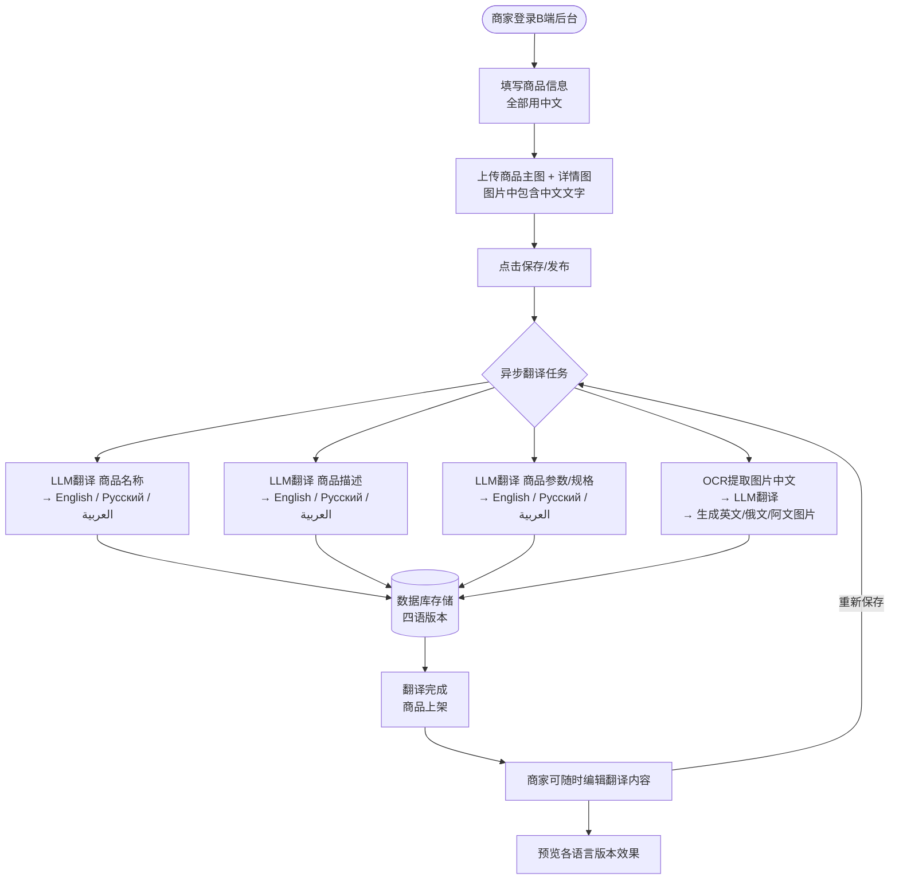
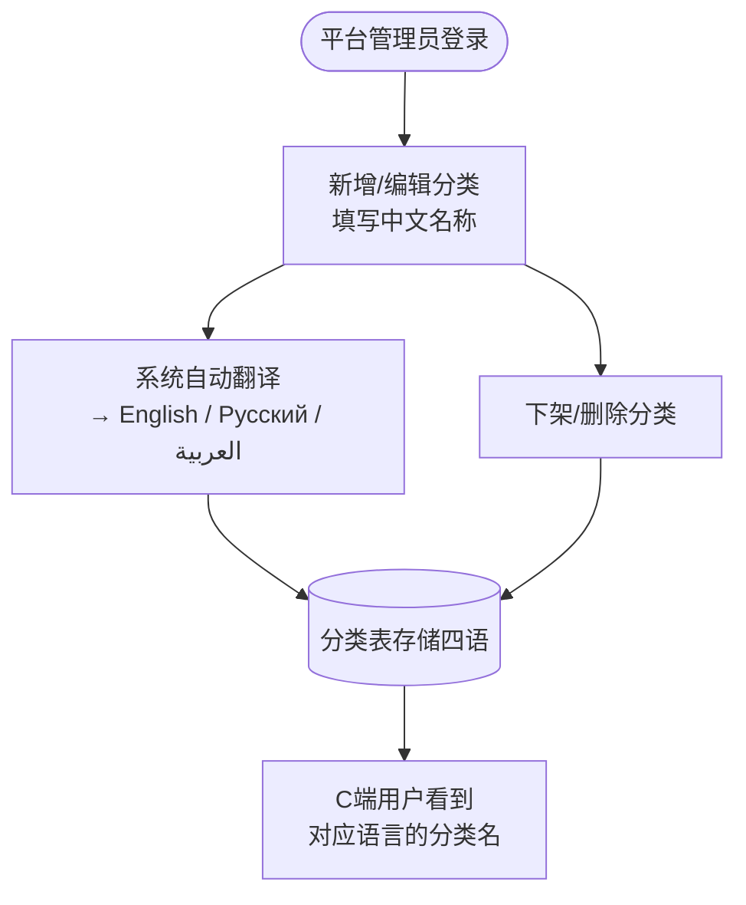
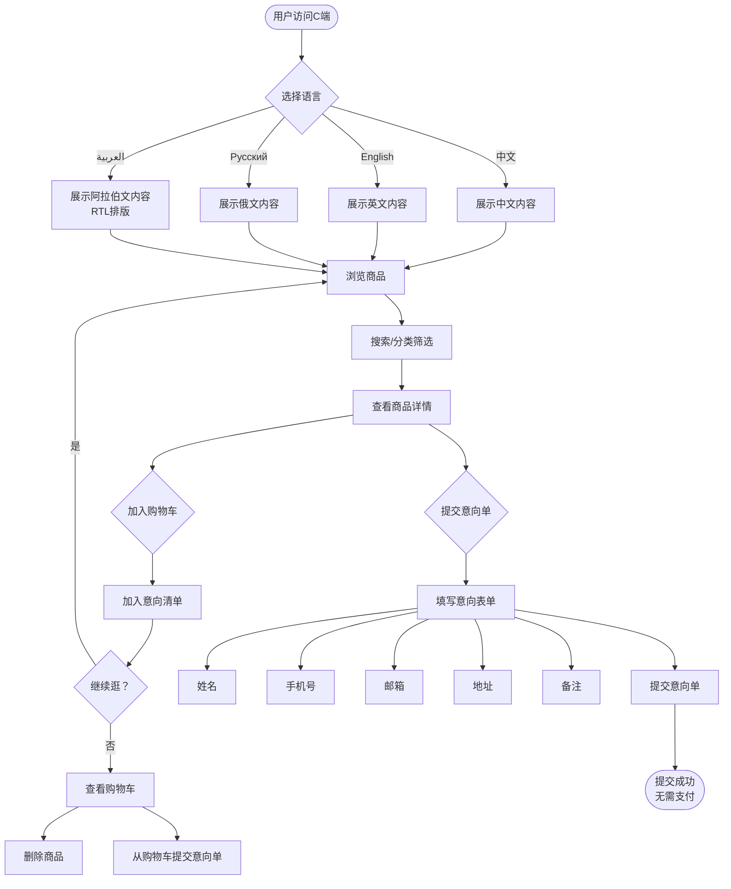
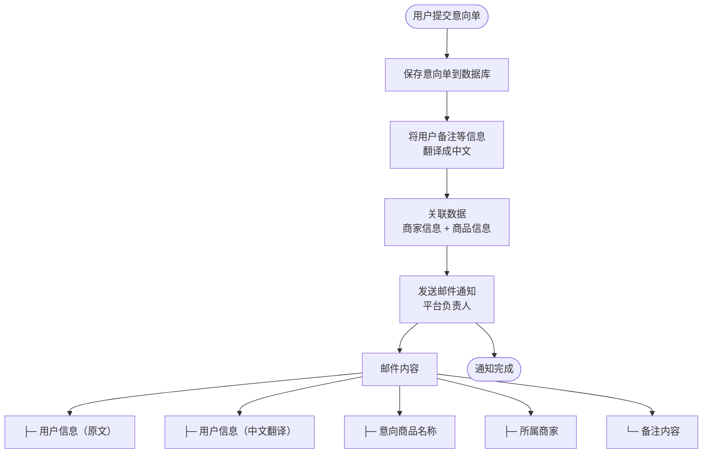
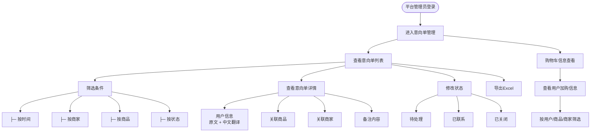
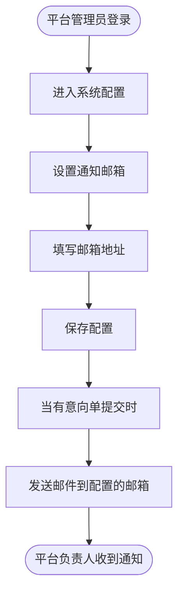
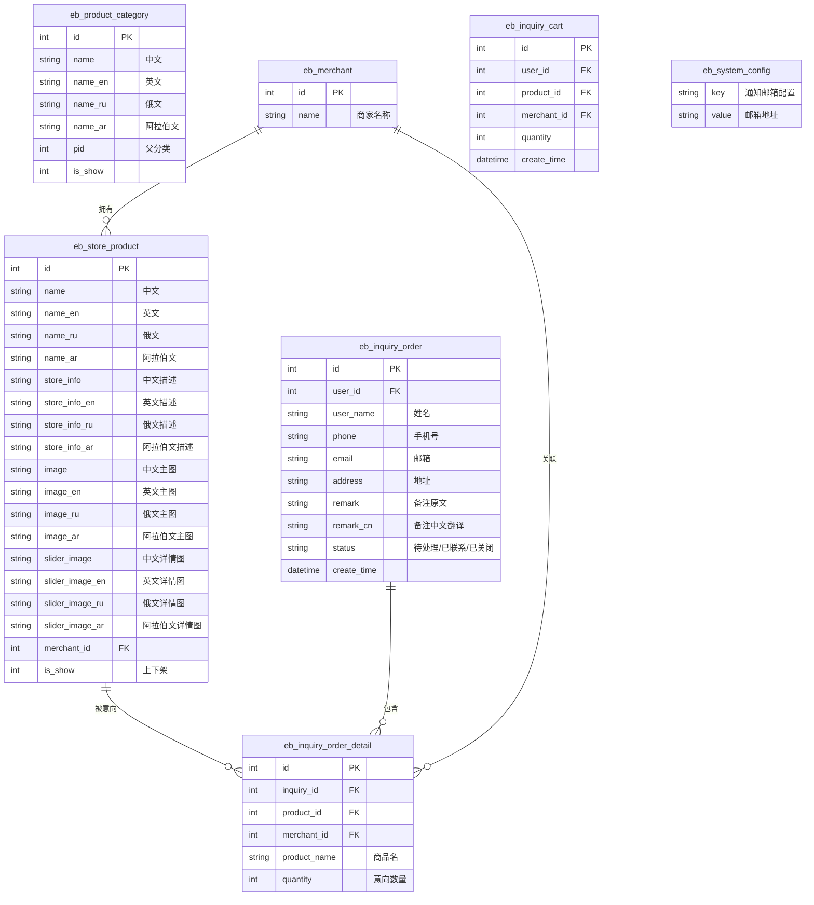
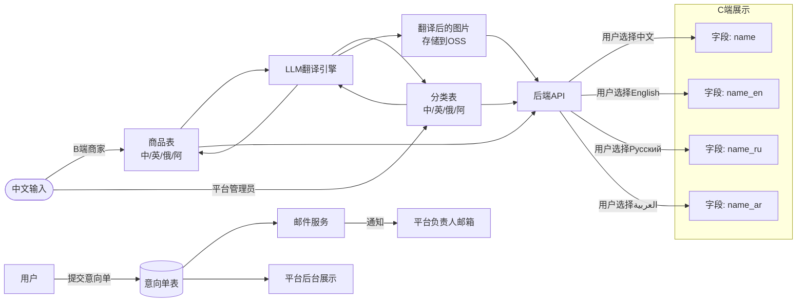

# 二开后系统流程图

> 定位：多语言商品展示平台（中/英/俄/阿拉伯）
> 无交易、无支付、无物流

---

## 一、整体架构图

```mermaid
graph TB
    subgraph B端[商家端]
        B1[发布商品<br/>中文]
    end

    subgraph 平台端[平台管理端]
        P1[分类管理<br/>中文]
        P2[商品审核/下架]
        P3[意向单管理]
        P4[邮箱配置]
        P5[购物车信息查看]
    end

    subgraph 自动翻译[LLM翻译引擎]
        T1[翻译商品名称]
        T2[翻译商品描述]
        T3[OCR+翻译商品图片]
        T4[翻译分类名称]
    end

    subgraph 数据库[(数据库)]
        DB1[商品表<br/>name/name_en/name_ru/name_ar]
        DB2[分类表<br/>name/name_en/name_ru/name_ar]
        DB3[商品图片<br/>image/image_en/image_ru/image_ar]
        DB4[意向单表]
        DB5[购物车表]
    end

    subgraph C端[用户端]
        C1[浏览商品]
        C2[切换语言<br/>中/英/俄/阿拉伯]
        C3[加入购物车]
        C4[提交意向单]
    end

    B1 --> T1
    B1 --> T2
    B1 --> T3
    P1 --> T4
    T1 --> DB1
    T2 --> DB1
    T3 --> DB3
    T4 --> DB2
    DB1 --> C1
    DB2 --> C1
    DB3 --> C1
    C1 --> C2
    C2 --> C1
    C1 --> C3
    C3 --> DB5
    C1 --> C4
    C4 --> DB4
    DB4 --> P3
    DB5 --> P5
    P3 --> P4
```

---

## 二、B端商品发布流程



---

## 三、平台端分类管理流程



---

## 四、C端用户浏览与操作流程



---

## 五、意向单提交流程（后端处理）



---

## 六、平台端意向单管理



---

## 七、平台端邮箱通知配置



---

## 八、数据表关系图



---

## 九、系统模块结构图

```mermaid
graph TB
    subgraph 后端[Spring Boot]
        direction TB
        S1[商品模块<br/>新增翻译字段]
        S2[分类模块<br/>新增翻译字段]
        S3[意向单模块<br/>新建]
        S4[购物车模块<br/>改造]
        S5[翻译模块<br/>LLM对接]
        S6[邮件通知模块<br/>改造]
        S7[系统配置<br/>邮箱配置]
    end

    subgraph C端[C端前端 UniApp]
        direction TB
        C1[首页<br/>四语切换]
        C2[分类页<br/>四语分类]
        C3[商品详情页<br/>四语商品+图片]
        C4[购物车页<br/>意向清单]
        C5[意向单页<br/>填写表单]
        C6[i18n<br/>ru + ar]
        C7[RTL适配<br/>阿拉伯语]
    end

    subgraph B端[B端 PC Nuxt.js]
        direction TB
        B1[商品发布<br/>中文输入]
        B2[多语言编辑<br/>Tab切换]
        B3[翻译预览<br/>各语言效果]
    end

    subgraph 平台端[平台管理 Vue]
        direction TB
        P1[分类管理<br/>多语言自动翻译]
        P2[商品管理<br/>下架权限]
        P3[意向单管理<br/>查看/筛选/导出]
        P4[购物车信息<br/>查看]
        P5[系统配置<br/>通知邮箱]
    end

    subgraph 外部[外部服务]
        direction TB
        E1[LLM翻译API<br/>GPT/Claude]
        E2[阿里云OSS<br/>图片存储]
        E3[阿里云邮件<br/>通知推送]
        E4[OCR服务<br/>图片文字识别]
    end

    S5 --> E1
    S5 --> E4
    S6 --> E3
    S1 --> E2
    S2 --> E2
```



---

## 十、数据流向图


