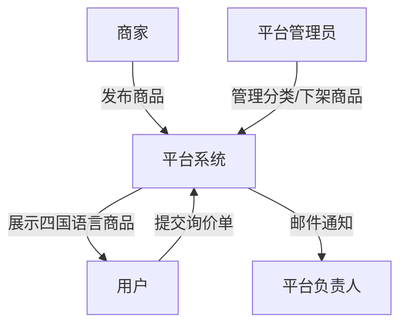
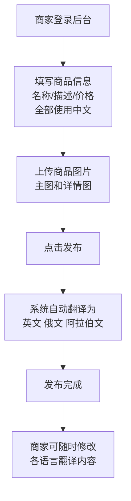
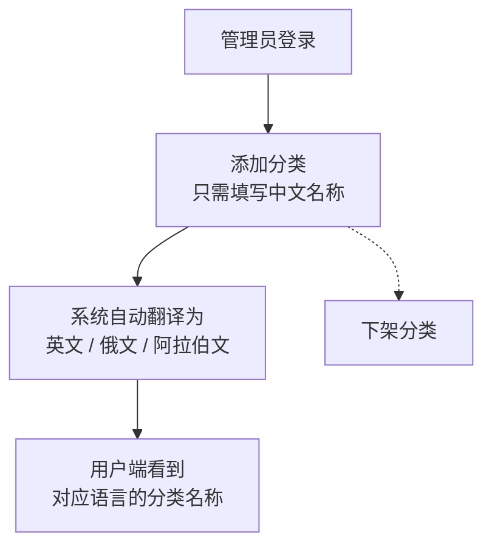
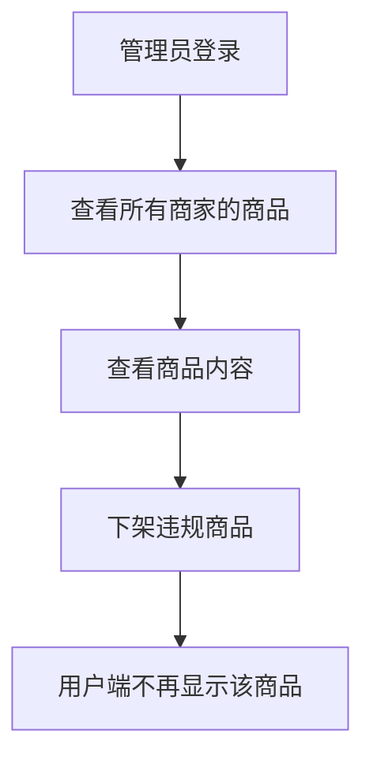
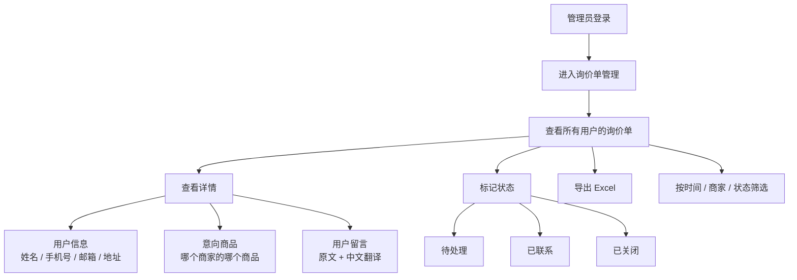
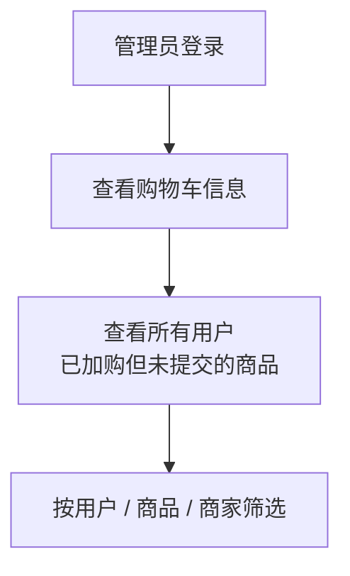
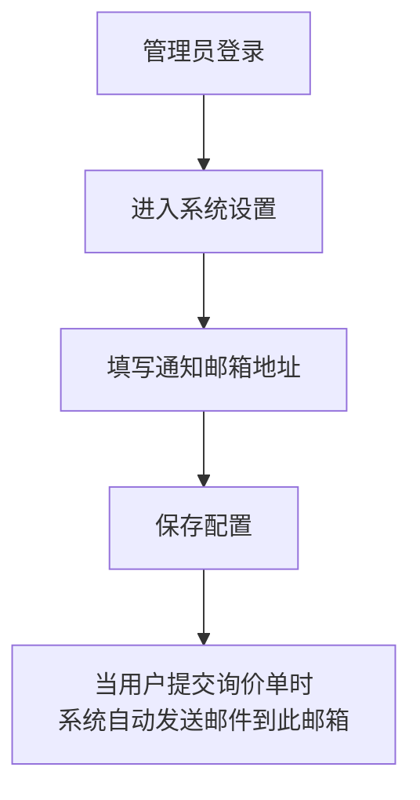
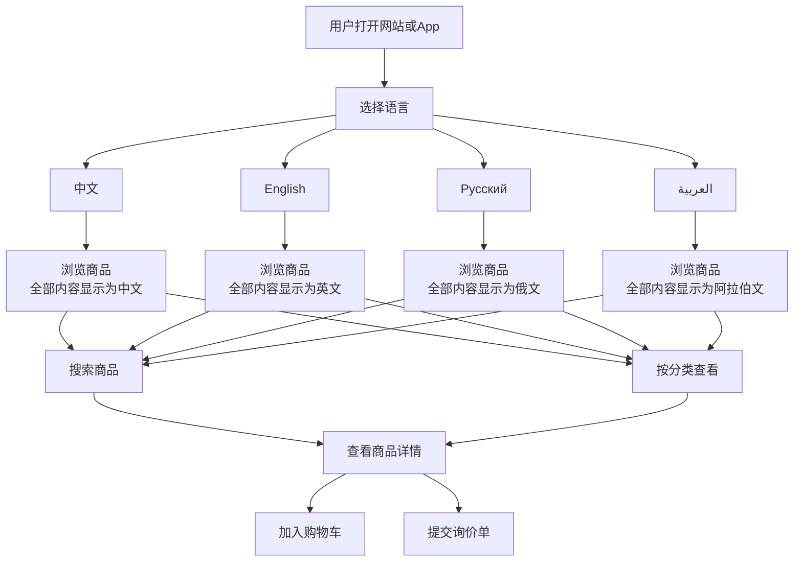
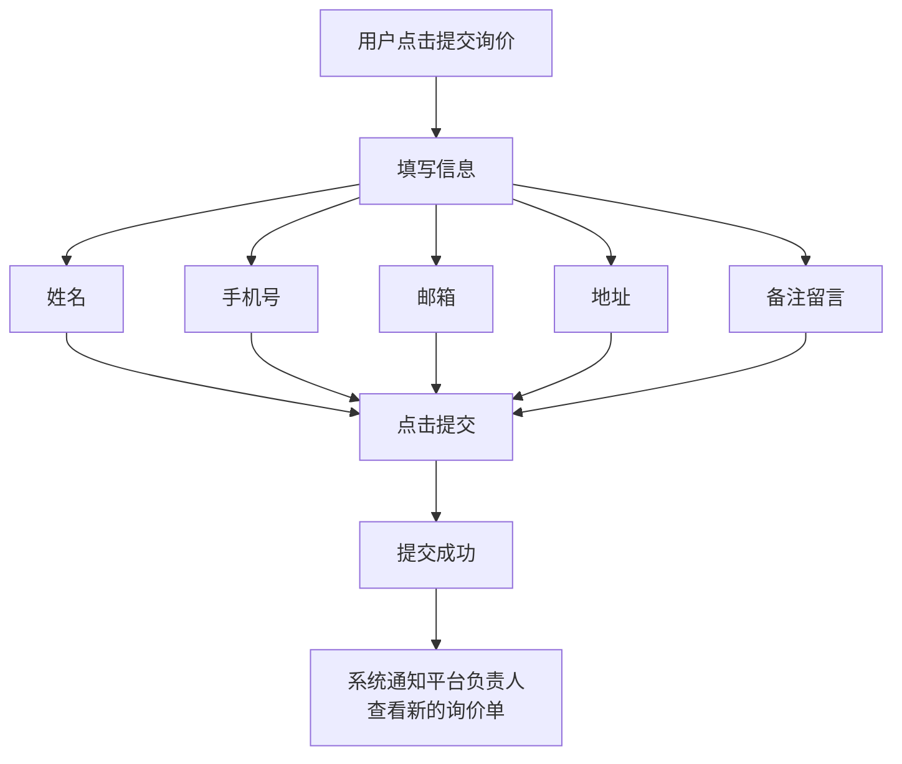
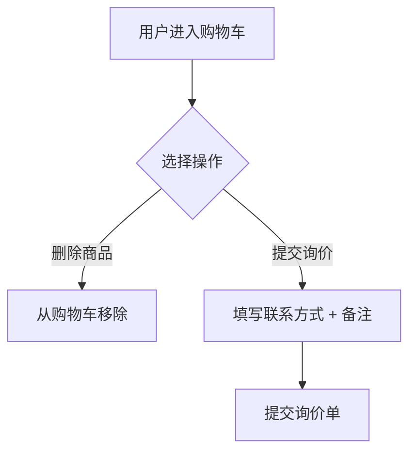

# 系统流程图

## 一、整体流程

---

## 二、商家端流程

---

## 三、平台管理端流程

### 3.1 分类管理

### 3.2 商品管理

### 3.3 询价单管理

### 3.4 购物车信息查看

### 3.5 邮箱配置

---

## 四、C端用户流程

### 4.1 浏览商品

### 4.2 提交询价单

### 4.3 购物车

---

## 五、功能对照表

| 功能 | 商家端 | 平台管理端 | 用户端 |
|------|--------|-----------|--------|
| 发布商品（填中文） | 可以 | - | - |
| 编辑翻译内容 | 可以 | - | - |
| 分类管理 | - | 可以 | - |
| 商品下架 | - | 可以 | - |
| 切换语言浏览 | - | - | 可以 |
| 加入购物车 | - | - | 可以 |
| 提交询价单 | - | - | 可以 |
| 查看询价单 | - | 可以 | - |
| 查看购物车信息 | - | 可以 | - |
| 配置通知邮箱 | - | 可以 | - |
| 收到邮件通知 | - | 可以 | - |

---

## 六、一句话总结

> **商家上传商品（只填中文）→ 系统自动翻译成英文/俄文/阿拉伯文 → 用户选择语言浏览商品 → 用户提交询价单（填联系方式）→ 平台收到邮件通知**

   
